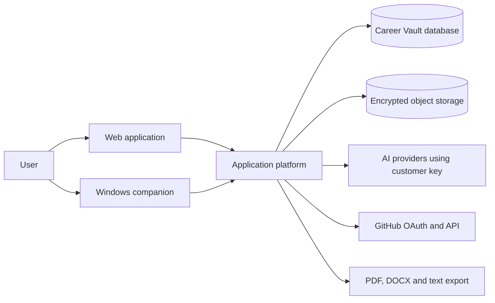
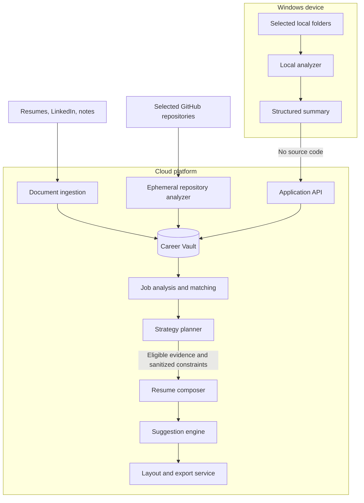
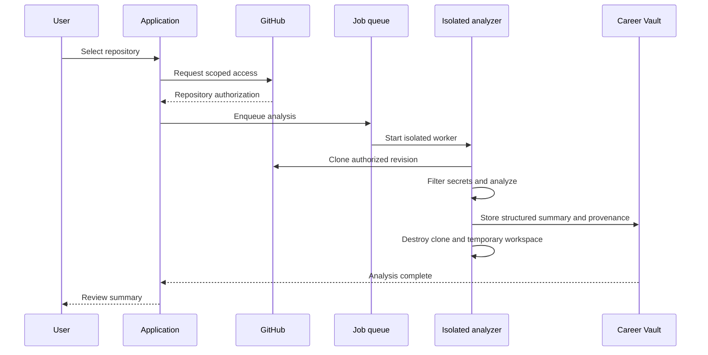
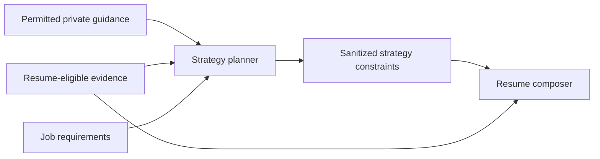

# System Architecture

## 1. Architecture objectives

The system must support evidence-backed resume generation while protecting four distinct trust boundaries:

1. A user's browser and account
2. Local source code on a Windows device
3. Temporarily cloned GitHub or uploaded repositories in cloud infrastructure
4. Third-party AI providers accessed with customer-provided API keys

The architecture separates ingestion, evidence, strategy, writing, and rendering so private context and unsupported inferences cannot leak into exported resumes.

## 2. System context



## 3. Primary data paths



## 4. Logical components

### 4.1 Web application

Responsibilities:

- Authentication and onboarding
- Source import and connection management
- Career Vault browsing and review
- Professional-identity management
- Job-description intake
- Evidence matrix and project recommendations
- Conversational interface
- Visual resume canvas and suggestion review
- Export, history, privacy, and deletion controls

The web application never receives direct filesystem access beyond files and folders explicitly selected through browser mechanisms.

### 4.2 Application API

The API is the authenticated boundary for all clients. It provides:

- Tenant authorization
- Request validation
- Rate and quota enforcement
- Idempotency keys for imports and synchronization
- Presigned upload and download operations
- Job submission and status reads
- Suggestion actions and resume versioning
- Companion pairing and token rotation

Business authorization must be enforced by the API and database access layer rather than trusted to client-provided workspace identifiers.

### 4.3 Identity and access service

Responsibilities:

- User authentication
- Workspace membership and tenant context
- Session lifecycle
- GitHub OAuth connection state
- Companion device pairing
- Revocation and recovery

The first release may contain only personal workspaces, but workspace-aware records avoid a disruptive future migration if coaches or collaborators are later supported.

### 4.4 Career Vault service

The Career Vault service owns normalized career data and enforces:

- Provenance requirements
- Fact risk and verification states
- Resume-eligibility rules
- Evidence links
- Conflict handling
- Professional-identity overlays
- Source and derived-data deletion

No other service may independently promote an inferred or high-risk fact to verified.

### 4.5 Document ingestion service

Responsibilities:

- Malware and file-type validation
- PDF/DOC/DOCX/text extraction
- LinkedIn-export parsing
- Structural segmentation
- Candidate-fact extraction
- Duplicate and conflict detection
- Provenance and source-location creation
- Review-queue routing

Original documents are stored only according to user-facing retention settings. Derived records keep evidence references that can be invalidated if a source is deleted.

### 4.6 Windows companion

The companion contains:

- Pairing and authentication client
- Folder-selection UI
- Filesystem watcher
- Debounce and incremental-change planner
- Ignore-policy and secret filter
- Language and framework detectors
- Repository and dependency parsers
- Local project analyzer
- Structured-summary builder
- Preview, trust, and sync controls
- Encrypted local cache and offline queue
- Update and diagnostic subsystem

#### Monitoring behavior

1. The user selects a folder.
2. The companion performs a safe initial inventory.
3. Ignored, secret-bearing, generated, dependency, and binary files are removed from the analysis set.
4. The local analyzer builds a versioned structured summary.
5. The first summary is previewed by the user.
6. If trusted, future meaningful changes trigger debounced incremental rescans and automatic summary synchronization.
7. If untrusted, a new summary remains pending until approved.

The watcher must coalesce rapid development changes, avoid loops caused by build output, and retain a last-known-good summary if a scan fails.

#### Local security requirements

- Source files never leave the device through this path.
- Local logs must not contain file contents, credentials, or full private paths unless the user explicitly creates a diagnostic bundle.
- Tokens are stored using Windows-provided secure credential storage.
- The companion verifies server certificates and signs or authenticates synchronization requests.
- Update packages are signed and verified.
- Users can view and clear the local cache.

### 4.7 Cloud repository analysis

This service handles GitHub OAuth repositories and intentionally uploaded repository content.

Pipeline:



Controls:

- Least-privilege repository authorization
- Per-repository user selection
- Network-restricted, tenant-isolated workers where practical
- Bounded processing time and file size
- Secret detection before AI calls
- No execution of untrusted repository code
- No installation of repository dependencies unless a later sandboxed feature explicitly requires it
- Deletion of raw clones and temporary files after analysis
- Commit reference retained for provenance

### 4.8 Project-summary service

Local and cloud analyzers emit the same versioned contract. The service:

- Validates schema and size
- Deduplicates snapshots
- Computes changed facts
- Preserves analysis method and source revision
- Routes risky inferences to review
- Updates project-level evidence without overwriting user-confirmed claims

A newer machine-generated summary can supersede an observed technical fact but cannot erase user-confirmed historical context or impact.

### 4.9 Job analysis and matching service

Responsibilities:

- Extract job requirements and priorities
- Normalize skills without discarding original wording
- Match requirements to verified Career Vault evidence
- Rank experiences and projects
- Identify gaps, conflicts, and useful questions
- Produce explainable match records

Matching combines deterministic filters with model-assisted semantic analysis. Deterministic rules enforce eligibility, privacy, verification, recency, and conflict constraints before model ranking.

### 4.10 Strategy planner and privacy firewall

The planner is the only stage permitted to use eligible private guidance under the user's active permissions.



Rules:

- Guidance-only text is never passed directly to the resume composer.
- The planner emits nonrevealing constraints, such as “do not emphasize this transition.”
- Sensitive context is included only for an explicitly authorized task.
- Excluded context is never loaded into an AI request.
- All outbound AI payloads are constructed from allowlisted data classes.

### 4.11 Resume composer

The composer receives:

- Approved strategy
- Selected identity
- Job requirements
- Resume-eligible evidence
- Confirmed project selection
- Template-independent content constraints

It outputs structured resume sections and items with evidence references. It cannot directly write rendered PDF or DOCX files and cannot create unreferenced high-risk claims.

### 4.12 Suggestion engine

The engine represents changes as semantic patches against resume nodes rather than raw document replacement.

Each suggestion contains:

- Target node and base version
- Original and proposed values
- Operation type
- Explanation
- Supported job requirements
- Evidence references
- Confidence and warnings
- Status and user action

Accepted suggestions create a new resume version. Rejected suggestions are remembered within the active strategy context to prevent repetition.

### 4.13 Conversation orchestrator

Responsibilities:

- Establish the active scope: vault, opportunity, resume, section, or project
- Retrieve only permitted evidence
- Cite evidence in answers
- Separate temporary messages from durable user actions
- Convert explicit user confirmations into audited fact updates
- Apply transcript expiration by default

The orchestrator must never treat ordinary conversational text as durable Career Vault data without an explicit save or confirmation action.

### 4.14 AI gateway and customer credentials

All cloud AI calls pass through a provider-neutral gateway that:

- Supports customer-provided API keys
- Decrypts saved keys only for an authorized request
- Supports session-only credentials
- Redacts keys and sensitive payloads from logs and traces
- Applies provider-specific request formatting and retry policies
- Records model and prompt-template versions without recording prohibited content
- Enforces task-specific schemas and output validation
- Supports cancellation, timeouts, and user-visible provider errors

Future local providers implement the same gateway contract through the Windows companion or an on-device inference service.

### 4.15 Rendering and export service

Responsibilities:

- Convert template-independent resume content into controlled layouts
- Calculate pagination and overflow
- Produce ATS/plain-text projection
- Validate required fields and prohibited claims
- Render PDF and DOCX
- Store immutable export metadata

Templates and rendering engines are versioned so an old export can be reproduced or explained after template updates.

### 4.16 Background job system

Long-running work is processed asynchronously:

- Document extraction
- Repository analysis
- Project-summary merging
- Job analysis
- Evidence matching
- Resume generation
- Export rendering
- Deletion propagation

Jobs are idempotent, retryable, tenant-scoped, and observable through user-facing state. Dead-lettered work must surface a recovery action rather than silently failing.

## 5. Storage architecture

### Relational database

Stores users, workspaces, sources, facts, evidence, identities, opportunities, matches, resume versions, suggestions, connections, job states, and audit metadata.

### Object storage

Stores original uploaded documents, explicitly uploaded repository archives during permitted retention, rendered exports, and optional saved diagnostic bundles. Objects are tenant-scoped and encrypted.

### Search and embeddings

Semantic indexes may accelerate evidence retrieval. They contain only data permitted for the relevant use and must preserve source identifiers. Deleting a source or fact also deletes its search representation.

### Ephemeral storage

Used for repository clones, conversion intermediates, temporary conversation context, and rendering workspaces. Expiration and deletion are automated and monitored.

## 6. Core service contracts

### Project summary

```json
{
  "schemaVersion": "1.0",
  "projectId": "project-id",
  "source": {
    "kind": "local_companion",
    "revision": "content-fingerprint",
    "analyzedAt": "timestamp"
  },
  "overview": {
    "name": "Project name",
    "description": "Observed summary",
    "status": "active"
  },
  "technologies": [
    {
      "name": "Technology",
      "evidence": ["relative/path"],
      "confidence": 0.93,
      "risk": "low"
    }
  ],
  "components": [],
  "features": [],
  "qualitySignals": [],
  "candidateInferences": [],
  "warnings": []
}
```

The actual contract must avoid transmitting code snippets or raw file contents from the local companion. Relative evidence paths may be represented as hashes or redacted identifiers if filenames themselves are sensitive.

### Resume suggestion

```json
{
  "suggestionId": "suggestion-id",
  "resumeVersionId": "base-version-id",
  "targetNodeId": "resume-item-id",
  "operation": "replace_text",
  "original": "Current content",
  "proposed": "Suggested content",
  "reason": "Reason tied to the approved strategy",
  "requirementIds": ["requirement-id"],
  "evidenceIds": ["evidence-id"],
  "confidence": 0.91,
  "warnings": [],
  "status": "pending"
}
```

## 7. Security and privacy boundaries

### Prohibited logging

The following must not enter standard logs or analytics:

- AI provider keys or OAuth tokens
- Raw source code
- Resume or private-context text
- Full document contents
- Unredacted local filesystem paths
- AI prompts and responses containing user data

Operational telemetry uses identifiers, durations, sizes, status codes, model identifiers, and redacted error categories.

### Secret filtering

Both local and cloud repository paths use layered filtering:

1. Built-in filename and directory exclusions
2. Repository ignore rules
3. Credential-pattern scanning
4. Entropy and private-key detection
5. File-size and binary checks
6. User-configurable exclusions

Detected secrets are neither uploaded nor sent to an AI provider. The system reports only safe metadata needed for remediation.

### Deletion propagation

Deletion uses a tracked job that removes or invalidates:

- Original objects
- Derived facts lacking other evidence
- Evidence links
- Search indexes and embeddings
- Project summaries
- Cached AI artifacts
- Temporary exports where applicable

The user sees deletion status and completion rather than receiving an immediate success message before propagation finishes.

## 8. Resilience and synchronization

- Every import and companion sync includes an idempotency key.
- Project summaries include schema version and source fingerprint.
- Conflicting concurrent resume edits produce a merge prompt rather than last-write-wins loss.
- Companion sync supports offline queueing with bounded retention.
- Background work is resumable where possible.
- A failed AI call does not corrupt the Career Vault or current resume version.
- Accepted suggestions are committed transactionally with their evidence and audit references.

## 9. Deployment shape

A practical first deployment can use a modular monolith for synchronous product APIs plus separate worker processes for untrusted or resource-heavy work:

- Web frontend
- Application API and domain modules
- Relational database
- Object storage
- Queue
- General background workers
- Isolated repository-analysis workers
- Rendering workers
- Windows companion distribution and update channel

This reduces premature distributed-system complexity while retaining firm process isolation for repository analysis and rendering.

## 10. Future local mode

The architecture supports gradual local replacement:

1. Local repository analysis already exists in release one.
2. Add local document extraction and secret-safe indexing.
3. Add a local AI gateway provider.
4. Add an encrypted local Career Vault replica or primary store.
5. Offer cloudless generation and rendering.

The Career Vault schema, project-summary contract, suggestion protocol, and rendering model remain stable across cloud and local execution.
