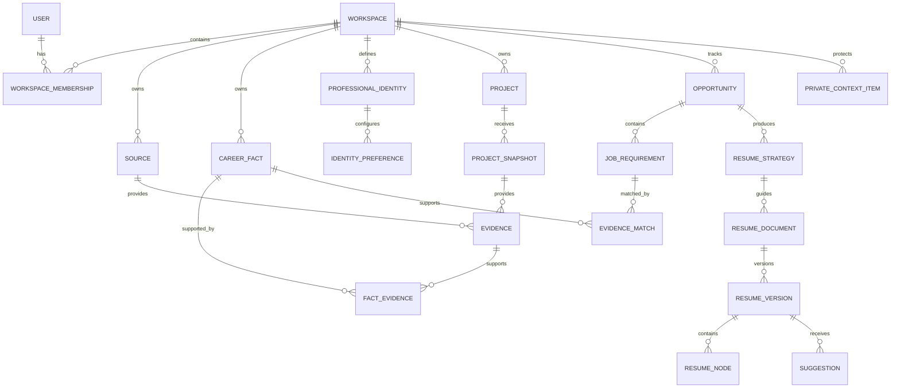

# Career Vault Data Model

## 1. Modeling goals

The Career Vault must:

- Represent many professions without assuming a software-engineering career
- Preserve the exact source and location supporting a fact
- Distinguish observation, inference, and user confirmation
- Keep verification separate from resume eligibility
- Support multiple professional identities without duplicating history
- Allow source deletion and derived-data invalidation
- Support local and cloud project analysis through one summary contract
- Keep private guidance outside the resume-content path
- Version resumes, suggestions, templates, and analysis output

## 2. High-level relationship model

## 3. Tenant and account entities

### `users`

Represents an authenticated person.

Key fields:

- `id`
- `primary_email`
- `display_name`
- `locale`
- `timezone`
- `created_at`
- `deleted_at`

### `workspaces`

Tenant boundary for all user data.

Key fields:

- `id`
- `name`
- `default_country_convention` — initially `US`
- `data_region`
- `created_at`
- `deletion_status`

### `workspace_memberships`

Supports one personal owner in release one and future collaboration without changing ownership fields throughout the schema.

Key fields:

- `workspace_id`
- `user_id`
- `role` — `owner`, future `editor`, future `reviewer`
- `status`

Invariant: every business query is scoped by an authorized workspace membership.

## 4. Connection and credential entities

### `ai_provider_credentials`

Stores metadata for customer-provided keys.

Key fields:

- `id`
- `workspace_id`
- `provider`
- `label`
- `storage_mode` — `session_only`, `encrypted_persistent`, future `local_only`
- `encrypted_secret_reference` — nullable
- `masked_hint`
- `status`
- `last_validated_at`
- `created_at`
- `revoked_at`

The raw key is never stored in this table, returned after entry, or written to logs.

### `oauth_connections`

Key fields:

- `id`
- `workspace_id`
- `provider` — initially `github`
- `external_account_id`
- `external_display_name`
- `encrypted_token_reference`
- `granted_scopes`
- `status`
- `connected_at`
- `expires_at`
- `revoked_at`

### `repository_authorizations`

Records explicit per-repository selection.

Key fields:

- `id`
- `oauth_connection_id`
- `external_repository_id`
- `repository_name`
- `visibility`
- `default_branch`
- `analysis_enabled`
- `last_authorized_at`
- `revoked_at`

## 5. Source and ingestion entities

### `sources`

Logical origin of Career Vault knowledge.

Key fields:

- `id`
- `workspace_id`
- `kind` — `resume_pdf`, `resume_doc`, `linkedin_export`, `note`, `repository_upload`, `github_repository`, `local_companion`, `manual`
- `display_name`
- `origin_metadata_json`
- `inspection_location` — `cloud`, `local`, `manual`
- `retention_policy`
- `status`
- `created_at`
- `deleted_at`

### `source_artifacts`

Represents a file, selected export, repository revision, or other material within a source.

Key fields:

- `id`
- `source_id`
- `artifact_type`
- `safe_name`
- `object_reference` — nullable for local-only source code
- `content_fingerprint`
- `size_bytes`
- `revision`
- `captured_at`
- `expires_at`
- `deleted_at`

### `ingestion_runs`

Key fields:

- `id`
- `source_id`
- `trigger` — `initial`, `manual`, `monitored_change`, `retry`
- `schema_version`
- `status`
- `started_at`
- `completed_at`
- `safe_error_code`
- `statistics_json`
- `idempotency_key`

### `evidence`

An addressable observation from a source.

Key fields:

- `id`
- `workspace_id`
- `source_id`
- `source_artifact_id`
- `project_snapshot_id` — nullable
- `evidence_type` — `text_span`, `document_field`, `repository_signal`, `user_confirmation`, `manual_entry`
- `locator_json` — page, section, field, relative safe path, or detector reference
- `safe_excerpt` — optional and governed by source visibility
- `observed_value_json`
- `confidence`
- `created_at`
- `invalidated_at`

Evidence is immutable. Corrections create new evidence and invalidate or supersede old evidence.

## 6. Career facts and provenance

### `career_facts`

An atomic statement that can support profiles, matching, and resume content.

Key fields:

- `id`
- `workspace_id`
- `subject_type` — `person`, `experience`, `project`, `education`, `credential`, `achievement`, `skill`, `organization`
- `subject_id`
- `predicate` — for example `title`, `start_date`, `used_skill`, `achieved_outcome`
- `value_json`
- `normalized_value_json`
- `evidence_type` — `observed`, `user_stated`, `inferred`
- `risk_level` — `low`, `medium`, `high`
- `verification_status` — `auto_accepted`, `pending_review`, `user_verified`, `rejected`, `superseded`, `in_conflict`
- `eligibility` — `eligible`, `guidance_only`, `sensitive`, `excluded`
- `confidence`
- `created_by` — user, ingestion run, analyzer, or AI run reference
- `created_at`
- `verified_at`
- `superseded_by_fact_id`
- `deleted_at`

### `fact_evidence`

Many-to-many relationship between facts and evidence.

Key fields:

- `fact_id`
- `evidence_id`
- `support_type` — `supports`, `contradicts`, `qualifies`
- `strength`

### `fact_conflicts`

Key fields:

- `id`
- `workspace_id`
- `subject_type`
- `subject_id`
- `predicate`
- `fact_ids`
- `status` — `open`, `resolved`, `dismissed`
- `resolution_fact_id`
- `resolved_by_user_id`
- `resolved_at`

### Fact invariants

1. High-risk facts cannot become `user_verified` without an explicit user action.
2. Inferred facts cannot silently change their evidence type to observed.
3. `user_verified` does not automatically mean `eligible`.
4. `eligible` does not automatically mean relevant to a specific job.
5. A fact in conflict cannot be exported until the relevant conflict is resolved or the fact is excluded.
6. A fact requires at least one active evidence record or an explicit manual user-confirmation record.
7. Machine analysis cannot overwrite user-confirmed values; it can create a conflict or new candidate fact.

## 7. Structured career entities

Domain entities provide convenient organization while `career_facts` preserve atomic claims and evidence.

### `person_profiles`

- `id`
- `workspace_id`
- `preferred_name`
- `contact_fields_json`
- `location_json`
- `links_json`

Contact fields are sensitive by default but may be explicitly resume-eligible.

### `organizations`

- `id`
- `workspace_id`
- `name`
- `industry`
- `location_json`
- `website`

### `experiences`

- `id`
- `workspace_id`
- `organization_id`
- `experience_type` — `employment`, `contract`, `freelance`, `volunteer`, `leadership`, `other`
- `canonical_title`
- `start_date`
- `end_date`
- `location_json`
- `status`

Dates and titles remain backed by high-risk facts even when projected into convenient fields.

### `achievements`

- `id`
- `workspace_id`
- `parent_type` — experience, project, education, or standalone
- `parent_id`
- `summary`
- `metric_json`
- `scope_json`
- `verification_status`

### `education_records`

- `id`
- `workspace_id`
- `institution_organization_id`
- `program`
- `field_of_study`
- `start_date`
- `end_date`
- `status`

### `credentials`

- `id`
- `workspace_id`
- `name`
- `issuing_organization_id`
- `issued_at`
- `expires_at`
- `credential_reference`
- `status`

Credentials are high-risk unless directly verified by the user or an authoritative source.

### `skills`

- `id`
- `workspace_id`
- `canonical_name`
- `category`
- `aliases`
- `profession_context`

### `entity_skills`

- `skill_id`
- `entity_type`
- `entity_id`
- `fact_id`
- `evidence_strength`
- `last_demonstrated_at`

Presence of a library in source code may establish project usage but not personal proficiency without stronger evidence.

## 8. Project entities

### `projects`

- `id`
- `workspace_id`
- `canonical_name`
- `project_type`
- `description`
- `status`
- `start_date`
- `end_date`
- `confidentiality` — `normal`, `restricted`, `never_resume`
- `created_at`

### `project_sources`

Allows one project to connect to a local folder, GitHub repository, upload, notes, and a resume simultaneously.

- `project_id`
- `source_id`
- `relationship`
- `active`

### `project_snapshots`

Versioned structured analysis output.

- `id`
- `project_id`
- `source_id`
- `ingestion_run_id`
- `schema_version`
- `source_revision`
- `content_fingerprint`
- `analysis_method` — `local_static`, `cloud_static`, `manual`
- `summary_json`
- `status`
- `created_at`
- `superseded_at`

### `project_roles`

User-confirmed relationship to a project.

- `id`
- `project_id`
- `role_name`
- `responsibility_summary`
- `ownership_level`
- `verification_status`

### `project_outcomes`

- `id`
- `project_id`
- `outcome_type`
- `description`
- `metric_json`
- `verification_status`
- `fact_id`

Ownership and outcomes are high-risk and require user confirmation.

## 9. Windows companion entities

### `companion_devices`

- `id`
- `workspace_id`
- `device_name`
- `platform` — release one `windows`
- `app_version`
- `public_key_or_device_identity`
- `status`
- `paired_at`
- `last_seen_at`
- `revoked_at`

### `monitored_projects`

- `id`
- `companion_device_id`
- `project_id`
- `local_path_alias` — no raw path required in cloud
- `trust_status` — `preview_required`, `trusted_auto_sync`, `paused`
- `ignore_policy_version`
- `last_fingerprint`
- `last_scan_at`
- `last_sync_at`
- `status`

The companion retains the actual local path. Cloud records use a user-friendly alias or redacted identifier.

### `companion_sync_events`

- `id`
- `monitored_project_id`
- `idempotency_key`
- `trigger`
- `summary_schema_version`
- `source_fingerprint`
- `status`
- `safe_statistics_json`
- `created_at`
- `completed_at`
- `safe_error_code`

## 10. Private context entities

### `private_context_items`

Stored separately from resume-eligible facts.

Key fields:

- `id`
- `workspace_id`
- `professional_identity_id` — nullable for global context
- `label`
- `content_ciphertext_reference`
- `classification` — `guidance_only`, `sensitive`, `excluded`
- `permitted_purposes` — strategy, question answering, identity coaching
- `default_enabled`
- `created_by_user_id`
- `created_at`
- `updated_at`
- `deleted_at`

### `strategy_constraints`

Sanitized outputs derived from permitted private context.

- `id`
- `resume_strategy_id`
- `constraint_type`
- `safe_instruction`
- `derivation_run_id`
- `expires_at`

The record intentionally does not contain the original private text. The resume composer may read active strategy constraints but cannot query `private_context_items`.

## 11. Professional identity entities

### `professional_identities`

- `id`
- `workspace_id`
- `name`
- `headline`
- `target_role_families`
- `narrative_summary`
- `is_default`
- `status`
- `created_at`

### `identity_preferences`

- `id`
- `professional_identity_id`
- `preference_type` — emphasized skill, preferred title, preferred project, excluded item, tone, section order
- `target_entity_type`
- `target_entity_id`
- `value_json`
- `priority`

Identity preferences affect selection and ordering but do not change underlying facts.

## 12. Opportunity and matching entities

### `opportunities`

- `id`
- `workspace_id`
- `professional_identity_id`
- `company_name`
- `role_title`
- `location_json`
- `job_description_text`
- `source_url`
- `user_notes`
- `country_convention` — initially `US`
- `status`
- `created_at`

### `job_requirements`

- `id`
- `opportunity_id`
- `original_text`
- `normalized_type` — skill, responsibility, experience, education, domain, credential, other
- `normalized_value`
- `importance` — required, preferred, inferred_priority
- `user_status` — active, essential, dismissed
- `confidence`

The original job wording is preserved even when normalized.

### `evidence_matches`

- `id`
- `job_requirement_id`
- `fact_id`
- `match_score`
- `evidence_quality_score`
- `recency_score`
- `identity_fit_score`
- `explanation`
- `status`

### `project_recommendations`

- `id`
- `opportunity_id`
- `project_id`
- `overall_score`
- `score_breakdown_json`
- `supported_requirement_ids`
- `explanation`
- `warnings`
- `user_decision` — undecided, selected, rejected

### `gap_questions`

- `id`
- `opportunity_id`
- `target_requirement_id`
- `question_text`
- `expected_value`
- `priority`
- `status`
- `answered_at`

Answers do not become facts until the user explicitly confirms saving them.

### `resume_strategies`

- `id`
- `opportunity_id`
- `professional_identity_id`
- `version`
- `positioning_summary`
- `target_length`
- `recommended_sections_json`
- `selected_entity_ids_json`
- `approved_at`
- `status`

## 13. Resume and suggestion entities

### `resume_documents`

Logical job-specific resume.

- `id`
- `workspace_id`
- `opportunity_id`
- `professional_identity_id`
- `resume_strategy_id`
- `title`
- `status`
- `created_at`

### `resume_versions`

- `id`
- `resume_document_id`
- `version_number`
- `parent_version_id`
- `change_source` — generation, accepted_suggestion, manual_edit, restore, template_migration
- `content_schema_version`
- `created_by`
- `created_at`

Versions are immutable. The document points to its current version.

### `resume_nodes`

Stores a template-independent tree.

- `id`
- `resume_version_id`
- `parent_node_id`
- `node_type` — header, summary, section, experience, project, education, skill_group, bullet, custom
- `position`
- `content_json`
- `locked`
- `source_entity_type`
- `source_entity_id`

### `resume_node_evidence`

- `resume_node_id`
- `fact_id`
- `usage_type`
- `claim_span_json`

Every factual resume node must have eligible evidence links. Pure formatting nodes are exempt.

### `suggestion_sets`

- `id`
- `resume_document_id`
- `base_resume_version_id`
- `request_text`
- `scope_node_id`
- `strategy_version`
- `status`
- `created_at`

### `suggestions`

- `id`
- `suggestion_set_id`
- `target_node_id`
- `operation`
- `original_value_json`
- `proposed_value_json`
- `reason`
- `confidence`
- `warnings_json`
- `status` — pending, accepted, rejected, modified, stale
- `acted_by_user_id`
- `acted_at`

### `suggestion_evidence`

- `suggestion_id`
- `fact_id`
- `job_requirement_id`
- `support_type`

### `resume_templates`

- `id`
- `name`
- `template_version`
- `country_convention`
- `layout_schema_json`
- `capabilities_json`
- `status`

### `resume_presentations`

Stores user-controlled appearance separately from resume content.

- `id`
- `resume_document_id`
- `template_id`
- `template_version`
- `settings_json` — typography, accent, density, section order, page target
- `updated_at`

### `exports`

- `id`
- `resume_version_id`
- `resume_presentation_id`
- `format` — PDF, DOCX, plain_text
- `object_reference`
- `validation_result_json`
- `created_at`
- `expires_at`

## 14. Conversation entities

### `conversation_sessions`

- `id`
- `workspace_id`
- `scope_type` — vault, opportunity, resume, project
- `scope_id`
- `persistence` — `temporary`, `saved`
- `expires_at`
- `created_at`
- `closed_at`

### `conversation_messages`

- `id`
- `conversation_session_id`
- `role`
- `encrypted_content_reference`
- `created_at`
- `expires_at`

### `conversation_actions`

Durable record of explicit actions taken from a conversation.

- `id`
- `conversation_session_id`
- `action_type` — confirm_fact, create_fact, update_identity, create_suggestion, accept_suggestion
- `target_type`
- `target_id`
- `user_confirmed_at`

Deleting an expired transcript does not delete separately confirmed facts or accepted resume changes.

## 15. Operational entities

### `ai_runs`

Stores safe execution metadata, not raw prompts or private outputs.

- `id`
- `workspace_id`
- `task_type`
- `provider`
- `model`
- `prompt_template_version`
- `input_classification_summary`
- `status`
- `token_usage_json`
- `safe_error_code`
- `created_at`
- `completed_at`

### `background_jobs`

- `id`
- `workspace_id`
- `job_type`
- `idempotency_key`
- `status`
- `attempt_count`
- `progress_json`
- `safe_error_code`
- `created_at`
- `completed_at`

### `audit_events`

- `id`
- `workspace_id`
- `actor_type`
- `actor_id`
- `event_type`
- `target_type`
- `target_id`
- `safe_metadata_json`
- `created_at`

Audit metadata must not copy resume text, private context, source code, API keys, or document contents.

### `deletion_jobs`

- `id`
- `workspace_id`
- `target_type`
- `target_id`
- `scope`
- `status`
- `affected_record_counts_json`
- `created_at`
- `completed_at`

## 16. Key lifecycle rules

### Import lifecycle

`uploaded -> extracting -> facts proposed -> low-risk auto-accepted -> high-risk review -> active`

### Fact lifecycle

`observed/inferred -> pending or auto-accepted -> user verified/rejected -> superseded or conflicted`

### Local project lifecycle

`folder selected -> first scan -> summary preview -> trusted/untrusted -> monitored -> rescan -> synchronized`

### Resume lifecycle

`strategy draft -> strategy approved -> resume generated -> suggestions pending -> versioned edits -> validated -> exported`

### Conversation lifecycle

`temporary open -> optional explicit durable actions -> closed -> transcript expired`

## 17. Export validation query rules

An export is blocked when any factual resume node:

- Has no active `resume_node_evidence`
- References a rejected, conflicted, excluded, or deleted fact
- Uses a pending high-risk fact
- Contains content derived from guidance-only, sensitive, or excluded private context
- Violates the active country convention's required constraints

An export may warn, but not necessarily block, when:

- Evidence is old or weak
- A preferred job requirement is unmatched
- Layout density is high
- ATS projection loses nonessential styling
- A project is redundant with another selected project

## 18. Deletion semantics

- Deleting a source invalidates its evidence.
- A fact survives source deletion only if it has another active evidence record or explicit user confirmation.
- Invalid facts are removed from matching indexes and cannot support new resume content.
- Existing resume versions remain historically identifiable but cannot be newly exported with invalid evidence unless the user reconfirms the claim.
- Deleting private context also deletes derived nonessential strategy constraints.
- Deleting a conversation removes transcript content but not explicitly accepted actions.
- Account deletion schedules deletion of all tenant data, credentials, objects, search indexes, companion pairings, and OAuth tokens.
