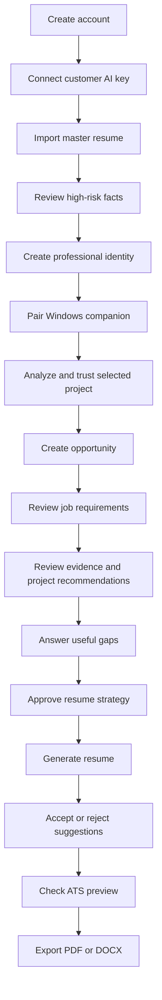

# Screen-by-Screen User Flow

## 1. Experience model

The product has four persistent destinations:

1. **Career Vault** — sources, facts, projects, identities, and private context
2. **Opportunities** — job descriptions, evidence matching, strategies, and resume versions
3. **Resume Studio** — conversation, live resume, suggestions, layout, and export
4. **Connections and settings** — AI keys, GitHub, Windows companion, privacy, and deletion

The Windows companion is a separate desktop surface paired with the same account.

## 2. Global interaction patterns

### Provenance badge

Every consequential fact can display:

- Observed, user stated, or inferred
- Auto-accepted, pending, verified, conflicted, or rejected
- Resume eligible, guidance only, sensitive, or excluded
- Source and evidence location

### Privacy badge

Private-context classification remains visible wherever private information is created or used. Changing a badge opens a concise explanation before saving.

### Background task center

A global task indicator shows imports, repository analysis, local synchronization, job analysis, generation, exports, and deletion jobs. Users can continue working while nonblocking tasks run.

### Suggestion behavior

AI-generated document changes never apply silently. A suggestion can be accepted, rejected, edited, deferred, or accepted as part of a reviewed group.

### Destructive actions

Disconnecting, revoking, and deleting explain which sources, evidence, derived facts, resumes, and exports are affected before confirmation.

## 3. First-run onboarding

### Screen 1 — Landing and sign-in

Purpose: Explain the product and begin a private workspace.

Key content:

- “Build a job-specific resume from evidence you already have.”
- Summary of Career Vault, project analysis, and suggestion-based editing
- Sign up and sign in
- Privacy and local-companion explanation

Primary action: **Create my Career Vault**

### Screen 2 — Workspace creation

Fields:

- Name
- Timezone and locale
- Default resume convention, fixed to United States in release one

The UI explains that country-specific formats will be added later.

Primary action: **Continue**

### Screen 3 — How the product uses information

Short interactive explanation:

- Master resumes are references and never edited.
- Low-risk facts may be accepted automatically.
- High-risk claims require approval.
- Private guidance can shape strategy but cannot appear in a resume.
- AI edits arrive as suggestions.

Primary action: **I understand**

### Screen 4 — Connect an AI provider

Fields:

- Provider
- API key
- Storage choice: session only or encrypted persistent storage
- Optional label

Actions:

- Test key
- View exact data-use explanation
- Skip for now

States:

- Validating
- Valid
- Invalid or insufficient access
- Provider unavailable

The key is masked after entry and never displayed again.

### Screen 5 — Choose a starting point

Cards:

- Import a resume
- Import LinkedIn data
- Add notes
- Connect GitHub
- Set up the Windows companion
- Start manually

The recommended path is importing a resume, but no source is mandatory.

## 4. Career Vault ingestion

### Screen 6 — Source importer

Supported choices:

- PDF, DOC, or DOCX resume
- LinkedIn export
- Notes
- Repository upload
- GitHub repository
- Local project through companion

Each option states where processing occurs and whether raw material is uploaded.

### Screen 7 — Document upload

Interaction:

- Drag-and-drop or browse
- Select source type
- Add an optional source label
- Review retention summary

The uploaded master resume is labeled **Reference only — it will not be modified**.

Primary action: **Extract career information**

### Screen 8 — Extraction progress

Shows stages:

- File validation
- Text and structure extraction
- Candidate facts
- Duplicate detection
- Conflict detection

The user may leave the screen. The task center retains progress.

Failure recovery:

- Unsupported or damaged file
- Password-protected document
- Low-text scan requiring a later OCR path
- Provider error

### Screen 9 — Import results

Summary cards:

- Experiences found
- Projects found
- Skills found
- Low-risk facts accepted
- Facts requiring review
- Conflicts detected

Actions:

- Review important facts
- Browse imported data
- Import another source

### Screen 10 — Important-fact review queue

One review card per claim:

- Proposed fact
- Source evidence
- Risk and confidence
- Conflicting values if any
- Accept, correct, reject, or mark private

High-risk examples:

- Employment title and dates
- Ownership
- Quantified outcomes
- Leadership claims
- Credentials

Progress can be saved. The user may use the product with an incomplete queue, but unverified high-risk facts cannot be exported.

### Screen 11 — Conflict resolution

Displays competing values side by side with their sources.

Actions:

- Choose the correct value
- Enter a corrected value
- Keep both as distinct contexts
- Exclude the fact from resume use
- Defer resolution

The chosen resolution creates a user-confirmed fact without deleting source history.

## 5. Career Vault workspace

### Screen 12 — Career Vault overview

Dashboard areas:

- Career completeness
- Facts needing attention
- Experiences
- Projects
- Skills and evidence
- Education and credentials
- Professional identities
- Private context
- Sources

Suggested prompts:

- “Which accomplishments need metrics?”
- “What do you know about my work at this organization?”
- “Where do my sources disagree?”

### Screen 13 — Experience detail

Displays:

- Organization, title, dates, and location
- Responsibilities and achievements
- Metrics
- Skills and projects connected to the experience
- Evidence and verification state

Actions:

- Edit a fact
- Add an accomplishment
- Add evidence
- Change resume eligibility
- Resolve a conflict

### Screen 14 — Project detail

Displays:

- Project description and status
- Connected sources
- Latest analyzed snapshot
- Technologies, components, features, and quality signals
- User-confirmed role, ownership, outcomes, scale, and metrics
- Resume-use history

Machine-observed information and user-confirmed personal claims are visually separated.

Actions:

- Confirm or correct an inference
- Add role or outcome
- Mark confidential or never use on resumes
- Compare project snapshots
- Request rescan

### Screen 15 — Skills and evidence

Displays skills grouped by user-selected or profession-neutral categories.

Each skill shows:

- Experiences and projects demonstrating it
- Last demonstrated date
- Evidence strength
- Whether the signal is repository usage or confirmed proficiency

Users can merge aliases, correct categorization, and remove weak or misleading associations.

### Screen 16 — Source detail

Displays:

- Source type and processing location
- Import or synchronization history
- Derived facts and projects
- Retention and deletion options

Deleting the source opens an impact preview showing which facts lose all evidence.

### Screen 17 — Private context manager

Sections:

- Guidance only
- Sensitive, explicit-use only
- Excluded

Each item shows permitted purposes and whether it is global or tied to an identity.

Actions:

- Add context
- Reclassify
- Edit
- Assign to an identity
- Delete

The screen includes an always-visible rule: **Private context cannot be used as resume content.**

## 6. Professional identities

### Screen 18 — Identity list

Displays identity cards such as:

- Software Engineer
- Founder
- Product Manager

Each card summarizes target roles, emphasized skills, preferred projects, and recent resumes.

Actions:

- Create identity
- Duplicate preferences into a new identity
- Set default
- Archive

Underlying career records are shared rather than duplicated.

### Screen 19 — Identity editor

Fields and controls:

- Identity name
- Target role families
- Headline and positioning
- Skills to emphasize
- Preferred and excluded projects
- Default section priorities
- Tone
- Identity-specific private guidance

The editor previews how the identity changes ranking without altering verified facts.

## 7. Windows companion setup and use

### Screen 20 — Companion setup in the web application

Displays:

- Windows download
- Installation steps
- Pairing code or secure pairing link
- Explanation that source code stays on the device
- Connected-device list

Actions:

- Generate pairing request
- Revoke a device
- View last-seen and app-version status

### Screen 21 — Companion welcome and pairing

Desktop interaction:

- Sign in or enter pairing code
- Confirm workspace and device name
- Review local-processing promise
- Pair device

The companion stores its token using Windows secure credential storage.

### Screen 22 — Companion dashboard

Displays:

- Connection status
- Monitored projects
- Trust and auto-sync status
- Last scan and last synchronization
- Pending summaries
- Warnings and errors

Global actions:

- Add project folder
- Pause all monitoring
- Sync now
- Open privacy settings
- Clear local cache

### Screen 23 — Select local project folder

Desktop folder picker with confirmation:

- Selected folder
- Detected repository or project type
- Default exclusions
- Optional custom ignore patterns
- Estimated analysis size

Primary action: **Analyze locally**

The user can cancel before any summary is created.

### Screen 24 — Local analysis preview

Displays the exact structured information proposed for upload:

- Safe project overview
- Technologies and evidence confidence
- Components and features
- Tests, deployment, and documentation signals
- Candidate inferences requiring later confirmation
- Excluded-file summary
- Warnings

Actions:

- Synchronize once
- Trust and enable automatic synchronization
- Edit display name
- Change exclusions and rescan
- Cancel and discard

Raw source code and secret values are never shown as upload payload.

### Screen 25 — Monitored project settings

Controls:

- Trusted automatic sync
- Monitoring paused or active
- Debounce and scan policy, exposed in simple terms
- Ignore patterns
- Rescan
- Disconnect folder
- Delete cloud summary

Status explains whether a local change has been detected, analyzed, queued, or synchronized.

## 8. GitHub and uploaded repositories

### Screen 26 — GitHub connection

Displays requested access and cloud-analysis behavior.

Actions:

- Connect GitHub
- Review granted scopes
- Disconnect

The screen explicitly states that selected repositories may be temporarily cloned in isolated cloud infrastructure.

### Screen 27 — Repository selector

Displays accessible repositories with:

- Name and owner
- Public or private visibility
- Last update
- Existing analysis status
- Selection checkbox

Only explicitly selected repositories are analyzed.

Primary action: **Analyze selected repositories**

### Screen 28 — Cloud analysis progress and result

Progress:

- Authorized
- Queued
- Temporary clone created
- Safe static analysis
- Structured summary stored
- Temporary clone deleted

Result uses the same summary-review experience as local projects but is labeled **Cloud analyzed**.

Actions:

- Confirm or correct summary
- Add ownership and outcome context
- Reanalyze latest revision
- Delete summary
- Revoke repository access

### Screen 29 — Repository upload

Before upload, the screen explains:

- The repository will be processed in cloud infrastructure.
- Secret filtering is applied but users should remove unnecessary sensitive files.
- The Windows companion is the recommended alternative when source code should remain local.

Actions:

- Select archive or folder
- Review file inventory and exclusions
- Upload and analyze

## 9. Opportunity creation and analysis

### Screen 30 — Opportunity list

Displays:

- Company and role
- Selected identity
- Resume progress
- Last activity
- Export status

Actions:

- Create opportunity
- Duplicate opportunity strategy
- Archive

### Screen 31 — New opportunity

Inputs:

- Job description paste or document upload
- Optional job URL
- Company and role
- Location
- Professional identity
- One- or two-page preference
- User priorities and notes

Primary action: **Analyze this job**

### Screen 32 — Job analysis

Displays extracted requirements grouped as:

- Required
- Preferred
- Responsibilities
- Seniority and leadership signals
- Domain knowledge
- Education or credentials
- Keywords and original wording

Actions:

- Mark essential
- Dismiss as irrelevant
- Correct extraction
- Add missing requirement
- Reanalyze

### Screen 33 — Evidence matrix

Three-column layout:

- Job requirement
- Supporting Career Vault evidence
- Strength, gaps, and actions

Actions:

- Open evidence
- Choose among competing examples
- Confirm an inferred connection
- Mark gap as irrelevant
- Ask the Vault

The user can proceed with gaps; the product does not imply they meet every requirement.

### Screen 34 — Project recommendations

Ranked project cards show:

- Overall score
- Requirements supported
- Evidence quality
- Recency and identity fit
- Redundancy warnings
- Missing confirmation
- Explanation of why the project is recommended

Actions:

- Select
- Reject
- Compare projects
- Add missing project context
- Ask for a different balance

The user makes the final project selection.

### Screen 35 — Focused gap interview

Conversational questions are ranked by expected resume value.

Examples:

- “What part of this project did you personally own?”
- “Was this used by real users?”
- “Can this result be quantified?”

Each answer offers explicit choices:

- Save as Career Vault fact
- Use only for this opportunity
- Keep temporary

High-risk answers require confirmation before becoming verified.

### Screen 36 — Resume strategy review

Displays:

- Target positioning
- Selected identity
- Recommended experience and projects
- Section order
- Content to emphasize, compress, or omit
- Length and density target
- Remaining warnings

Private guidance appears only as safe constraints, never original private text.

Actions:

- Approve and generate
- Edit strategy
- Change project selection
- Return to evidence matrix

## 10. Resume Studio

### Screen 37 — Generation progress

Stages:

- Validate eligible evidence
- Assemble section plan
- Draft structured content
- Attach evidence
- Apply controlled layout
- Validate claims and pagination

The existing opportunity state remains usable if generation fails.

### Screen 38 — Main Resume Studio

Three-panel desktop layout:

- **Left:** Conversation and prompt history for the active temporary session
- **Center:** Live visual resume canvas
- **Right:** Suggestions, evidence, job coverage, and warnings

Top controls:

- Resume version
- Identity
- Template
- ATS preview
- Export

Canvas interactions:

- Select section, entry, or bullet
- Directly edit permitted text
- Lock an item
- Reorder permitted sections
- Open supporting evidence

Example request:

> Make the selected project more concise and emphasize backend architecture.

The AI returns suggestions without changing the canvas until accepted.

### Screen 39 — Suggestion review

Each suggestion card shows:

- Original and proposed content
- Reason
- Job requirements supported
- Evidence
- Confidence and risk warning
- Accept, reject, edit, or defer

Actions:

- Accept one
- Accept reviewed group
- Reject
- Modify before accepting
- Ask why

If the underlying resume changed, the suggestion becomes stale and must be regenerated or manually reconciled.

### Screen 40 — Evidence inspector

Opened from a resume claim or suggestion.

Displays:

- Facts supporting the claim
- Source locations
- Verification and eligibility
- Conflicts or weak evidence
- Where else the fact is used

Actions:

- Verify or correct fact
- Replace evidence
- Remove claim from resume

### Screen 41 — Layout controls

Controls:

- Launch template
- Typography preset
- Accent color
- Density
- Section order
- One- or two-page target

The user cannot freely position arbitrary elements. The system shows overflow and readability effects immediately.

### Screen 42 — ATS and plain-text preview

Displays:

- Parsed section order
- Plain-text representation
- Heading and date consistency
- Overflow or parsing warnings
- Keyword coverage as descriptive evidence, not a guaranteed score

Actions:

- Return to edit
- Open affected section
- Continue to validation

### Screen 43 — Version history

Displays timeline entries for:

- Initial generation
- Accepted suggestions
- Manual edits
- Strategy changes
- Template migrations
- Restores

Actions:

- Preview
- Compare versions
- Restore as a new version
- Name a milestone

No historical version is destructively overwritten.

### Screen 44 — Final validation and export

Validation groups:

- Blocking claim issues
- Verification and conflict issues
- Layout and overflow
- ATS/plain-text warnings
- Unmatched essential requirements

Blocking issues link directly to the affected claim or fact.

Export options:

- PDF
- DOCX
- Plain text

Each export records the content version, template version, opportunity, identity, and timestamp.

## 11. Career Vault conversation

### Screen 45 — Ask the Vault

The user chooses a scope:

- Entire Career Vault
- Professional identity
- Experience
- Project
- Opportunity
- Resume

Answers cite evidence and label inference.

Conversation header states **Temporary conversation** and offers **Save conversation**.

When the user closes it:

- Unsaved transcript receives its expiration time.
- Accepted facts and explicit actions remain.
- Temporary answers that were never confirmed do not become Career Vault data.

## 12. Settings, privacy, and account control

### Screen 46 — AI provider settings

Displays provider connections, storage mode, validation status, usage metadata, and revoke actions.

Actions:

- Add provider
- Test key
- Change storage mode
- Replace key
- Revoke key

### Screen 47 — Connections

Sections:

- GitHub
- Companion devices
- Authorized repositories
- Monitored-project summaries

Actions expose the difference between disconnecting access and deleting derived data.

### Screen 48 — Privacy and retention

Controls:

- Temporary conversation retention
- Original document retention
- Saved export retention
- Private-context defaults
- Diagnostic-data consent
- Download personal data

### Screen 49 — Delete data

Users can delete:

- Individual sources and derived facts
- Projects and snapshots
- Opportunities and resumes
- Conversations
- AI keys
- OAuth connections
- Companion pairings
- Entire account

The screen shows an impact preview and tracked deletion status.

## 13. Critical exception flows

### AI key failure

- Preserve all user work.
- Explain whether the key is invalid, rate limited, out of credit, or the provider is unavailable when safely knowable.
- Offer retry, replace key, or switch provider.

### Companion offline

- Show last-seen time and last-known-good summary.
- Resume work continues using existing evidence.
- Folder changes queue locally until reconnection.

### Local scan detects a secret

- Exclude the file or value.
- Show a safe warning without exposing the secret.
- Allow the user to add an ignore rule and rescan.
- Never upload the detected secret.

### GitHub authorization expires

- Preserve existing structured summaries.
- Stop reanalysis.
- Prompt reconnection only when needed.

### Source conflict discovered during generation

- Stop the affected claim from entering the resume.
- Continue generating unaffected sections when possible.
- Route the user directly to conflict resolution.

### Resume overflows target pages

- Preserve content.
- Show controlled suggestions for compression, reordering, or a less spacious template.
- Never silently shrink text below accessibility limits.

### Temporary conversation closes accidentally

- Apply a short recoverable grace period before expiration.
- Do not treat recovery as permanent saving.

## 14. Primary end-to-end happy path

## 15. First-release usability test scenarios

1. A new user imports a resume and correctly distinguishes auto-accepted facts from high-risk review items.
2. A user creates two professional identities without duplicating employment history.
3. A user pairs the Windows companion and understands that local source code is not uploaded.
4. A user trusts one local project and later understands an automatic synchronized update.
5. A user selects one GitHub repository and understands that cloud infrastructure temporarily inspects it.
6. A user identifies why one project is recommended over another for a job.
7. A user adds private guidance and verifies that it never appears in resume content.
8. A user requests a targeted edit and understands that the canvas remains unchanged until acceptance.
9. A user finds and resolves the evidence behind a blocked claim.
10. A user closes a temporary conversation while preserving a fact they explicitly saved.
11. A user exports a parseable resume and can identify which opportunity, identity, and version produced it.
