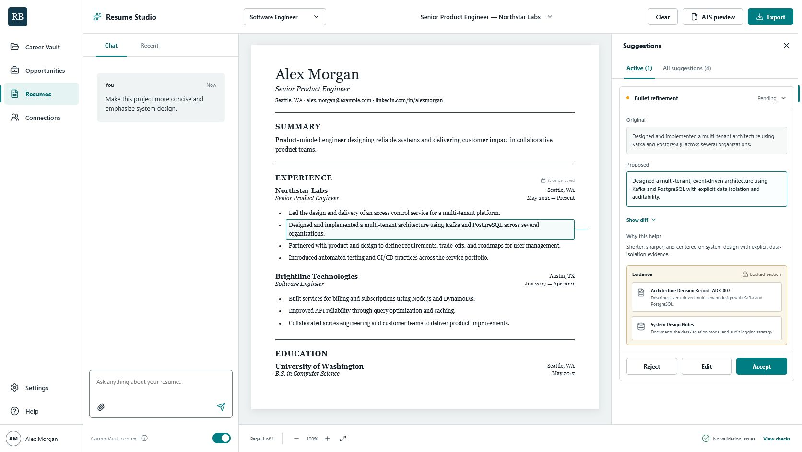

# Resume Builder

An evidence-backed, job-specific resume workspace built around a structured
Career Vault. It imports prior career materials, preserves provenance, routes
consequential claims through review, and keeps every AI-generated edit under
the user's control.



## Why this project exists

Most resume tools begin with a blank document or rewrite whatever text they are
given. Resume Builder starts one layer earlier: it builds a reusable career
database from resumes, notes, professional profiles, and explicitly selected
projects. A master resume remains an unchanged reference source; each tailored
resume is assembled from approved facts and evidence.

The core invariant is simple:

> No claim may enter an exported resume unless it is resume-eligible and backed
> by evidence or explicit user confirmation.

## What works today

- PDF, DOC, DOCX, TXT, and pasted-text resume ingestion
- Deterministic fact extraction with evidence locators
- Low-risk observed-skill auto-acceptance
- Review queues for high- and medium-risk claims
- Accept, reject, and correct actions without modifying source documents
- Durable Postgres-compatible Career Vault storage
- Database-backed, hashed local development sessions
- Multiple professional identities over one shared career history
- Session-only BYOK credentials with masked readback and revocation
- Interactive Resume Studio with suggestion review and ATS projection
- Privacy-safe Windows project-analyzer foundation
- Double-click Windows launcher with dependency checks, health checks, and restart handling

The first release remains profession-neutral and follows US resume conventions.

## Architecture

```text
apps/
  web/          React and Vite product interface
  api/          Fastify API, authentication, ingestion, and Career Vault
  worker/       Background-job boundary
  companion/    Windows local-project analyzer boundary
packages/
  contracts/    Versioned JSON Schema and TypeScript contracts
design/
  concepts/     Product design references
  qa/           Verified interface captures
```

Local development uses file-backed embedded Postgres under `data/postgres/`.
Deployments can use a normal PostgreSQL server through `DATABASE_URL`; both
adapters run the same ordered SQL migrations.

## Quick start on Windows

Prerequisites:

- Node.js 24
- npm 11 or newer

Clone the repository and double-click `start.bat`, or run:

```powershell
npm install
npm run dev
```

Open:

- Web application: `http://127.0.0.1:5173`
- API health: `http://127.0.0.1:4010/health`

The launcher installs dependencies, restarts the tracked development session,
waits for both services, and opens the app after they become healthy.

## Validation

```powershell
npm run check
```

The repository gate runs linting, TypeScript checks, unit and contract tests,
restart-persistence tests, and production builds for every workspace.

## Privacy and security defaults

- Master resumes are reference-only and are never edited.
- Raw local source code does not cross the Windows companion boundary.
- High-risk facts require explicit approval.
- Client-provided workspace identifiers are not trusted.
- Session tokens are stored as hashes in the database.
- AI keys are never returned or written to standard logs.
- Private guidance is separated from resume-eligible content.
- Local databases, logs, credentials, certificates, and `.env` files are ignored by Git.

See [.env.example](.env.example) and [DEVELOPMENT.md](DEVELOPMENT.md) for local
configuration details.

## Product and engineering documents

1. [Product requirements](01-product-requirements.md)
2. [System architecture](02-system-architecture.md)
3. [Career Vault data model](03-career-vault-data-model.md)
4. [Screen-by-screen user flow](04-screen-by-screen-user-flow.md)
5. [Implementation roadmap](05-implementation-roadmap.md)
6. [Technical stack and ADRs](06-technical-stack-and-adrs.md)
7. [Data contracts](07-data-contracts.md)
8. [Current Milestone 1 status](08-milestone-1-status.md)

## Current boundaries

The next major work includes external OIDC onboarding, encrypted persistent AI
credentials, GitHub OAuth analysis, the packaged Windows companion, opportunity
matching, structured resume generation, and production PDF/DOCX export.

The project is under active development and should not yet be treated as a
production hiring or document-retention service.
